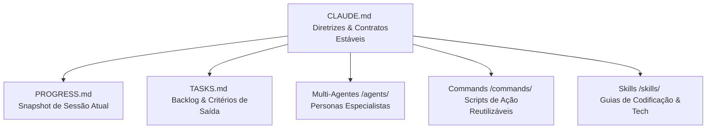

# 🤖 Replicador da Estrutura de Desenvolvimento IA (Multi-Agentes & Context-Driven)

Esta documentação analisa a arquitetura de orquestração de Inteligência Artificial utilizada no repositório atual e fornece um **Prompt Coringa (Universal)** para que você possa inicializar e recriar essa mesma estrutura em qualquer outro projeto, independentemente da stack tecnológica.

---

## 1. Análise da Estrutura de IA Existente

A estrutura deste repositório foi projetada para resolver um dos maiores problemas no desenvolvimento com IA: a perda de contexto, alucinações arquiteturais e repetição de erros. Ela se baseia em quatro pilares fundamentais:



### 1.1. A Tríade de Orquestração
*   **[CLAUDE.md](file:///D:/clientes/Resultech/mvppoc_evolucao/CLAUDE.md)** (Estável): É a "constituição" do projeto. Define a stack, os contratos de arquitetura que nunca podem ser quebrados (ex: desacoplamento de hardware), mapeia os agentes e contém os checklists universais de pré e pós-tarefa. Ele não guarda estado do projeto para evitar consumo excessivo de tokens.
*   **[PROGRESS.md](file:///D:/clientes/Resultech/mvppoc_evolucao/PROGRESS.md)** (Dinâmico): É a memória de curto prazo da IA. Guarda o status atual do projeto, qual a próxima tarefa recomendada, **tentativas que falharam** (para a IA não repetir a mesma abordagem que deu errado) e perguntas em aberto. Mantém apenas as últimas 5 sessões (o resto é arquivado).
*   **[TASKS.md](file:///D:/clientes/Resultech/mvppoc_evolucao/TASKS.md)** (Granular): O checklist de execução. Divide o projeto em fases funcionais claras com critérios de saída rígidos. Evita que a IA tente fazer tudo de uma vez.

### 1.2. Especialização via Multi-Agentes (`/agents/`)
Em vez de usar uma única persona genérica de desenvolvedor, a estrutura utiliza markdown files no diretório `/agents/` (como `architect.md`, `rfid-engineer.md`, `qa-engineer.md`) contendo instruções de comportamento, responsabilidades e checklists específicos para aquele domínio do código.

### 1.3. Comandos e Habilidades (`/commands/` e `/skills/`)
*   **Commands:** Prompts prontos em markdown para tarefas repetitivas (ex: criar tela, gerar migração, fazer code review).
*   **Skills:** Guias técnicos estruturados detalhando boas práticas da linguagem ou de frameworks específicos (ex: concorrência em C#, regras de Clean Architecture).

---

## 2. O Prompt Coringa (Universal)

Copie o bloco de texto abaixo e envie como a primeira mensagem para um assistente de IA (como Claude, GPT ou similar) dentro do repositório onde deseja aplicar esta estrutura.

```markdown
Você é um Engenheiro de Software Principal especialista em Orquestração de Agentes e Desenvolvimento Orientado a Contexto. 
O seu objetivo é criar uma estrutura de desenvolvimento orientada a IA idêntica à especificada abaixo, mas adaptada ao contexto, stack e arquivos deste repositório atual.

### 1. Passo de Diagnóstico (OBRIGATÓRIO)
Antes de criar qualquer arquivo, você deve ler a estrutura de arquivos e analisar o repositório atual para entender:
1. Qual a linguagem de programação, frameworks e stack tecnológica principal.
2. A arquitetura atual do projeto (ex: MVC, Clean Architecture, Monólito, Microsserviços, etc.).
3. Qual o objetivo/problema que a aplicação resolve.
4. Quais são as principais pendências ou próximos passos lógicos.

Apresente um resumo rápido desse diagnóstico e peça confirmação para prosseguir.

### 2. Passo de Inicialização (Após Confirmação)
Uma vez confirmado o diagnóstico, você deverá criar a seguinte estrutura na raiz do repositório:

1. **`CLAUDE.md`**: O arquivo de governança central. Deve conter:
   - Diretiva de Execução Multi-Agente (com tabela de agentes aplicáveis à nova stack).
   - Lista de artefatos de controle.
   - Protocolo de execução obrigatório.
   - Contratos Arquiteturais Estritos (defina de 5 a 8 regras de ouro específicas para a stack encontrada).
   - Checklists universais de Pré e Pós-tarefa (incluindo validação real por build/testes).
   - Restrições globais.

2. **`PROGRESS.md`**: O snapshot dinâmico do projeto. Deve conter:
   - "Onde o projeto está agora" mapeando as fases e a porcentagem aproximada de conclusão com base no seu diagnóstico.
   - Próxima tarefa recomendada.
   - Seção para "Tentativas que falharam / becos sem saída" (inicialmente vazia ou com alertas do diagnóstico).
   - Seção de "Limitações conhecidas" e "Perguntas em aberto".
   - Registro da primeira sessão com o status do que foi feito na inicialização.

3. **`TASKS.md`**: O checklist granular das próximas tarefas. Deve conter:
   - Divisão em fases claras do projeto.
   - Critérios de saída para cada fase.
   - Checklists funcionais (`- [ ]`) granulares para as próximas tarefas necessárias identificadas no diagnóstico.

4. **Diretório `agents/`**:
   - Um arquivo `agents/README.md` explicando o funcionamento e mapeamento das personas.
   - De 4 a 6 personas de agentes especializados em markdown (ex: `architect.md`, `database-engineer.md`, `qa-engineer.md`, `frontend-engineer.md` dependendo da stack encontrada), contendo papel, responsabilidades, ativação e checklists específicos.

5. **Diretório `commands/`**:
   - Modelos prontos de prompts em markdown para tarefas comuns (ex: `criar-feature.md`, `fix-bug.md`, `code-review.md`, `commit.md`).

6. **Diretório `skills/`**:
   - Guias curtos e pragmáticos de skills recomendadas para a stack (ex: `clean-code.md`, `test-patterns.md`).

### Regras de Execução para Você:
- Seja extremamente pragmático. Não crie placeholders vazios; adapte tudo ao projeto real que você está lendo.
- Escreva todos os arquivos e diretórios na raiz do projeto.
- Use nomes consistentes e links markdown funcionais (`file:///...`) entre os documentos criados para facilitar a navegação.

Inicie agora listando os arquivos do repositório para realizar o Diagnóstico (Passo 1) e descreva o que você identificou.
```

---

## 3. Como Utilizar

1.  **Abra o novo repositório** na sua IDE ou terminal onde você executa a sua ferramenta de IA.
2.  **Copie o prompt coringa** acima.
3.  **Cole no chat** e envie.
4.  A IA fará uma leitura inicial do código, identificará a stack (ex: React, Python/FastAPI, Node.js, Go) e te apresentará um resumo do diagnóstico pedindo autorização.
5.  **Diga "Proceder" ou "Aprovado"**.
6.  A IA criará automaticamente o `CLAUDE.md`, `PROGRESS.md`, `TASKS.md` e as pastas correspondentes, totalmente customizados para a stack do seu novo sistema.
